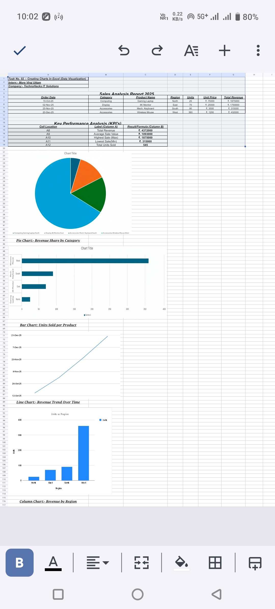
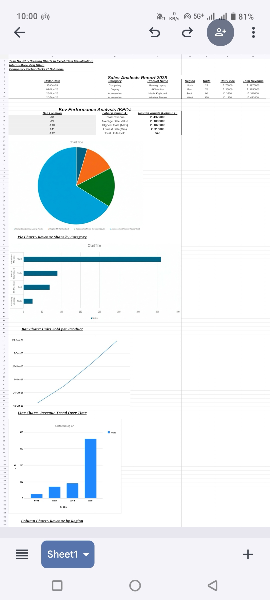

# Task 02: - Creating Charts in Excel (Data Visualization)

## 📌 Executive Summary
In this phase, I translated complex quantitative findings into high-impact visual narratives. The goal was to build a comprehensive Sales Dashboard that provides stakeholders with immediate insights into market trends, regional variances, and product performance trajectories.

## 📖 Visual Analytics Dictionary
| Visualization Type | Strategic Insight Provided |
| :--- | :--- |
| **Pie Chart** | Market share distribution across categories. |
| **Bar Chart** | Comparative analysis of inventory throughput. |
| **Line Chart** | Temporal growth and revenue momentum. |
| **Column Chart** | Geographic revenue benchmarking. |

## 📸 Visual Documentation

## 🎥 Visualization Walkthrough
* **[Interactive Dashboard Demo on LinkedIn](https://www.linkedin.com/posts/viraj-more-a24a80391_technohacks-datavisualization-googlesheets-ugcPost-7410176855951093760-2Ozv?utm_source=social_share_send&utm_medium=android_app&rcm=ACoAAGBx1bwBTHGt8EcrWtMOC6HHwclHdoFx_b0&utm_campaign=copy_link)** 🚀

## 🛠️ Project Deliverables
* **[📊 Live Dashboard: Interactive Google Sheets](https://drive.google.com/drive/folders/1k2dAiJvBb0On1dpFwguytcU_z9Pg-JM0)**
* **[📁 Download: Visualization Assets](https://drive.google.com/drive/folders/1nV0sk0kZyr9u7sN-yAtyQWUnbcGE2dYo)**

---

## 🎓 Acknowledgment
Sincere thanks to **TechnoHacks IT Solutions** and **Mr. Sandip Gavit (CEO)** for this opportunity. This task helped me bridge the gap between Mechanical Engineering and Data Analytics through professional project-based learning.

**Thank you for exploring this visual data narrative.**
*Intern: More Viraj Uttam | Branch: Mechanical Engineering*

